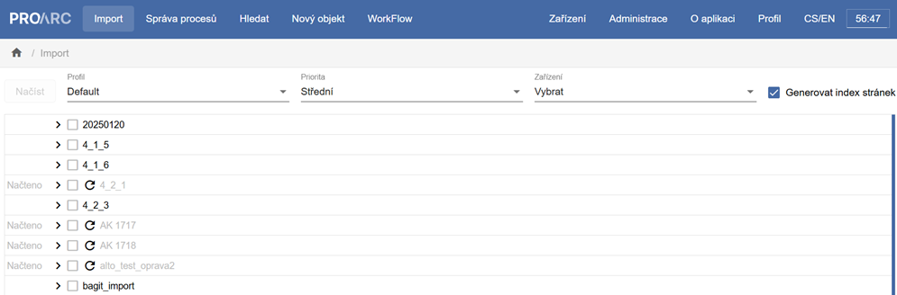
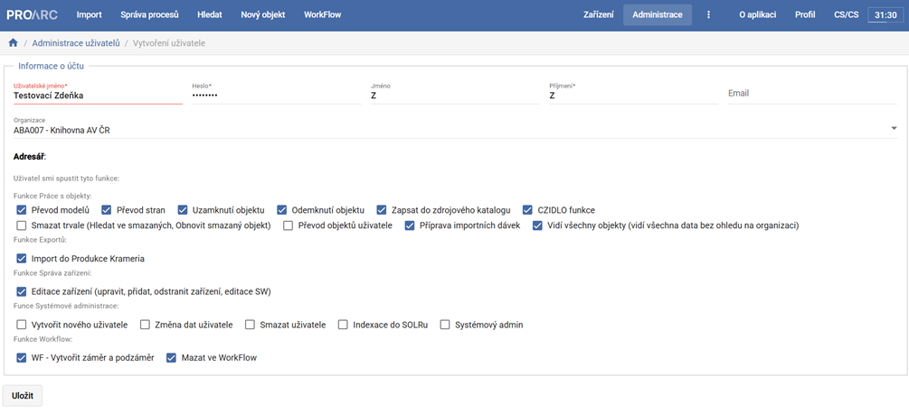
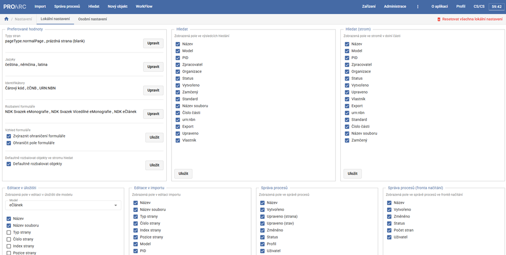

# ProArc 4.3.x

Verze 4.3.3 obsahuje kompletní vývoj systému za rok 2025. Je určena pro fungování s ProArc Klient X.X.X

Mezi hlavní vylepšení patří:

 -  **[Implementace aktuálních Definic metadatových formátů (DMF)](#implementace-aktualnich-definic-metadatovych-formatu-dmf)** se zaměřením na elektronické publikace.
 - **[Optimalizace uživatelské práce a rozhraní](#optimalizace-uzivatelske-prace)** pro rychlejší paginaci, přehlednější správu importů a flexibilnější práci s uživatelskými rolemi.
 - **[Optimalizace interních procesů](#optimalizace-a-kontroly-procesu)** a rozšíření možností hromadných operací nad daty.

----

## Implementace aktuálních Definic metadatových formátů (DMF)

Systém ProArc byl aktualizován tak, aby reflektoval změny v Definicích metadatových formátů (DMF) a v Pravidlech popisu dokumentů pro digitalizaci vydaných Národní knihovnou ČR v době vydané koncem roku 2024, přinášející změny zejména v oblasti elektronických monografií a periodik.

Společně s aktualizací DMF byly rozšířeny funkce usnadňující metadatový popis:

- **Nově lze automaticky kopírovat metadata z titulové úrovně vícesvazkové monografie do jednotlivých svazků**.   
Kromě názvu publikace a informacích o původu titulu, jsou nově automaticky zkopírovány také údaje o autorech, jazyku, fyzickém popisu zdroje, poznámky, předmětová hesla, klasifikace, identifikátory a údaje o uložení popisovaného dokumentu.
- **V souladu s DMF byla doplněna možnost přidávání příloh k hudebninám.**
- **Proběhla revize povolených hodnot podle aktuálních Pravidel popisu**. Byly doplněny nové typy (např. „Doslov“, „Závěr“) a odstraněny již nepodporované hodnoty. Systém nyní aktivně upozorňuje na nutnost opravy u starších typů dokumentů při pokusu o export.
- **Přidána podpora pro propojování tištěných a elektronických periodik**. Systém nově umožňuje spravovat tištěné i born-digital ročníky pod jednou titulní úrovní při zachování správných metadatových standardů pro oba typy (adekvátní nastavení elementů genre a physicalDescription při exportu). To řeší situaci, kdy tištěný titul plynule přejde do výhradně digitální podoby.

## Optimalizace uživatelské práce

- **Upravena obrazovka s importními dávkami**. Na začátek seznamu importních dávek přidán nový sloupec se stavem „Načteno“ a již hotové položky jsou nyní vizuálně potlačeny (zašednuty). Přidány nové sloupce, které umožňují rozlišit mezi úpravou jednotlivých stran a změnou celkového stavu dávky. Podle těchto sloupců lze nově řadit i filtrovat. 

- **Rozšířeno vyhledávání**, které nyní podporuje hledání podle signatury nebo čárového kódu.
- **Možnost volby zobrazovaných sloupců** na různých obrazovkách.
- **Úpravy při paginaci a hromadných úpravách stran**: V editoru byla pro jednotlivé strany přidána tlačítka pro rychlé ozávorkování, která změnu uloží okamžitě bez nutnosti potvrzování ikonou diskety. Formulář hromadných úprav byl přeuspořádán do logičtějšího pořadí „Prefix – Číslo od – Sufix“ a přibyla nová funkce pro hromadné nastavení reprezentativní strany.
- **Revize systému správy uživatelů, rolí a oprávnění**: Nová koncepce nahrazuje pevné role systémem detailních oprávnění (checkboxů), což zvyšuje bezpečnost a flexibilitu – uživatelé vidí pouze funkce, které skutečně potřebují. Administrační rozhraní bylo redesignováno a oprávnění jsou logicky seskupena do kategorií (např. práce s objekty, export, systémová administrace).

- **Uživatelské preference** se nově neukládají do mezipaměti (cache) prohlížeče, ale přímo do databáze. Nastavení (např. tloušťka ohraničení formulářů, často používané hodnoty, rozvržení obrazovek) jsou tak vázána na uživatelský účet a jsou k dispozici na jakémkoliv zařízení či prohlížeči.

- **Integrace se systémem PERO-OCR**. Nyní lze volat generování textové vrstvy ALTO/OCR nad více stranami najednou a uživatelé si mohou vybírat z dostupných modelů jak při hromadných korekcích z editoru, tak v rámci importních profilů.

## Optimalizace a kontroly procesů

- **Zavedena funkce odloženého spouštění procesů** (import, export, mazání): Tato funkcionalita umožňuje přesunout systémově náročné operace mimo pracovní dobu, čímž se předchází přetížení infrastruktury během dne.
- **Zrychlení nahrávání PDF souborů** (typicky u e-článků a e-monografií): Původní proces, který při nahrání PDF souběžně generoval náhledový obrázek (thumbnail), byl rozdělen na dvě části. Systém nyní po nahrání souboru umožní uživateli okamžitě pokračovat v práci, zatímco náhledy pro systém Kramerius se generují automaticky na pozadí jako samostatný proces.
- **Zefektivnění mazání dat**: Systém nyní pracuje se složitějšími strukturami logicky po jednotlivých celcích od nejnižšího po nejvyšší úroveň. Mazání se nově objevuje ve správě procesů. 
- **Přidány nástroje pro hromadné čištění dat**, jako je funkce pro trvalé odstranění objektů s příznakem „smazáno“ nebo rozhraní pro vkládání seznamů UUID k hromadnému smazání. Nově byla implementována také funkce pro vyhledávání a odstranění tzv. sirotků, tedy objektů (stran, kapitol, článků), které ztratily vazbu na nadřazenou úroveň a v systému existují osamoceně.
- **Implementovaná upravená kontrola validace UUID**: nově obsahuje výjimku pro starší pravidla tvorby identifikátorů, což umožňuje bezproblémový import historických dat ze systému Kramerius, která nemusí splňovat současné syntaktické normy. 
- **Rozšířena podpora importu dokumentů ve formátu FOXML**, která nově zahrnuje i vícedílné monografie.
