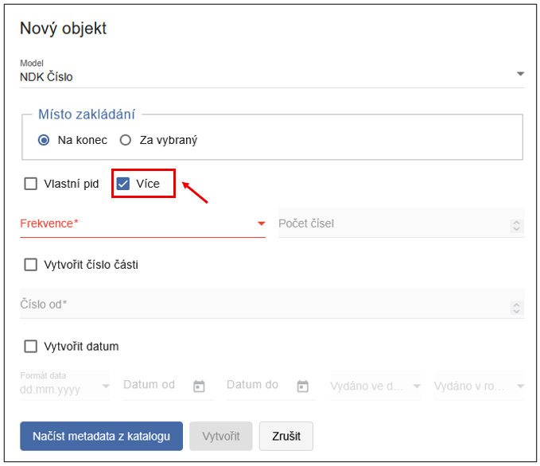
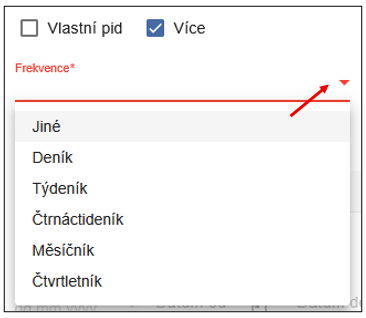
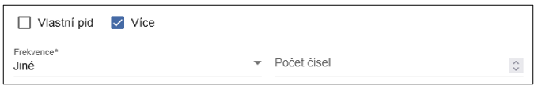
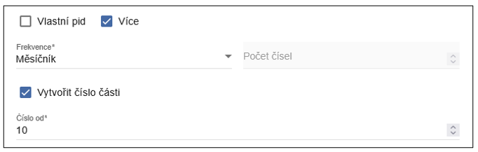
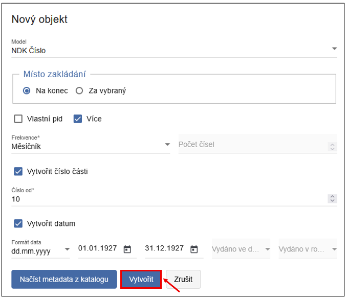
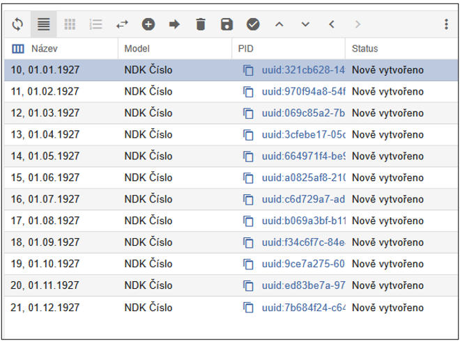
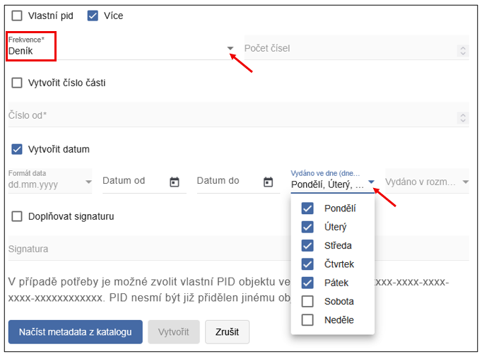

--
status: new
--

# Hromadné zakládání NDK Čísel přes funkci Více

Funkce **Více** slouží k hromadnému zakládání čísel (výtisků) v rámci periodika. Jedná se o částečně automatizovanou funkci, při které uživatel zadá základní parametry a systém na jejich základě vytvoří odpovídající strukturu a založí požadovaný počet čísel.

Tato funkce je využívána zejména při zakládání **NDK čísel** (výtisků) v periodiku.

Funkci Více naleznete v dialogovém okně **Nový objekt** na úrovni **ročníku**.  Aby bylo možné funkci použít, je nutné zaškrtnout checkbox **Více**. Po jeho aktivaci se zpřístupní další volby, zejména pole **Frekvence**.

!!! warning "Upozornění" 
    Pokud není checkbox **Více** zaškrtnutý, související nabídky zůstávají neaktivní (zašedlé).

V poli **Frekvence** je k dispozici roletka s následujícími hodnotami: `Jiné`, `Deník`, `Týdeník`, `Čtrnáctideník`, `Měsíčník` a `Čtvrtletník`. Při výběru předdefinované frekvence systém automaticky dopočítá počet čísel, která mají být založena, na základě zadaného časového rozsahu.

Pole **Počet čísel** je v tomto případě neaktivní. Pole **Počet čísel** se aktivuje pouze při zvolení frekvence `Jiné`. Tato možnost je vhodná zejména v situacích, kdy: 

- není známo přesné datum vydání jednotlivých čísel, 
- počet čísel neodpovídá běžné publikační frekvenci.

V poli **Vytvořit číslo od** lze určit počáteční hodnotu číslování.  
Není nutné začínat od čísla 1 - zadáním hodnoty 10 začne ProArc vytvářet čísla 10, 11, 12, 13 atd.

Datum vydání lze generovat v jednom ze tří předdefinovaných formátů:

- `dd.mm.yyyy` - den.měsíc.rok (např. 01.12.1927)
- `mm.yyyy` - měsíc.rok (např. 07.1927)
- `yyyy` - rok (např. 1927)

{width=500 .centered}

Po zadání výše zmíněných kritérií a kliknutím na tlačítko **Vytvořit** se automaticky vytvoří tato čísla:

{width=500 .centered}

Při zvolení frekvence `Deník` je možné určit, ve které dny týdne čísla vycházela. Výběr se provádí z roletky obsahující hodnoty `Pondělí` až `Neděle`. Tato volba umožňuje přesněji definovat strukturu periodika (např. vynechání víkendových vydání).

Stejně jako u ručního zakládání objektů lze i při použití funkce Více zvolit, zda budou nově vytvořená čísla vložena **Na konec**, nebo **Za vybraný** objekt. Chování odpovídá principům popsaným v obecné části manuálu věnované zakládání objektů.