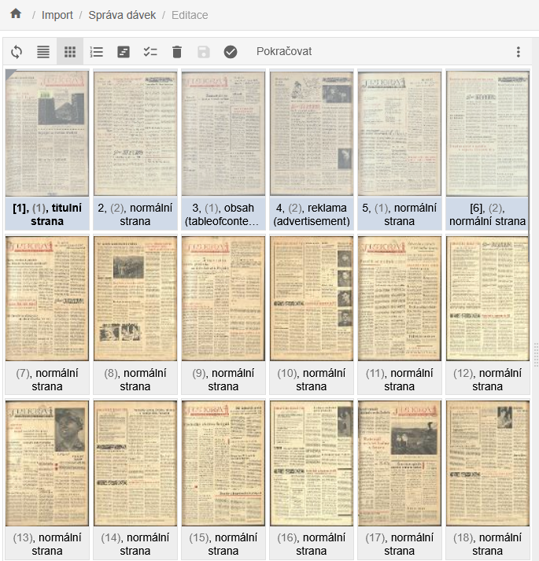
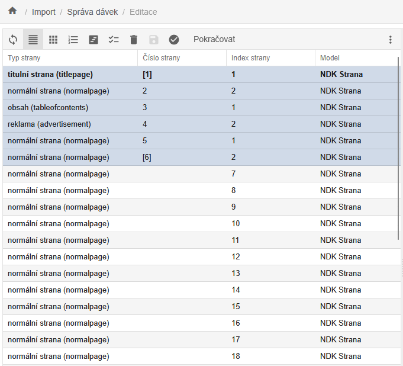
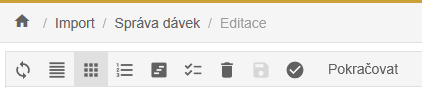
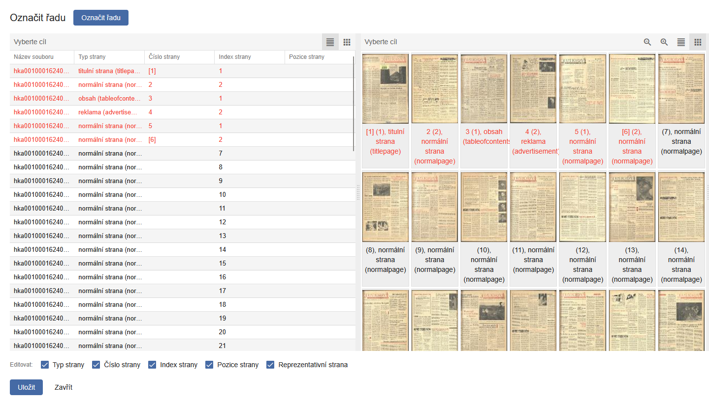
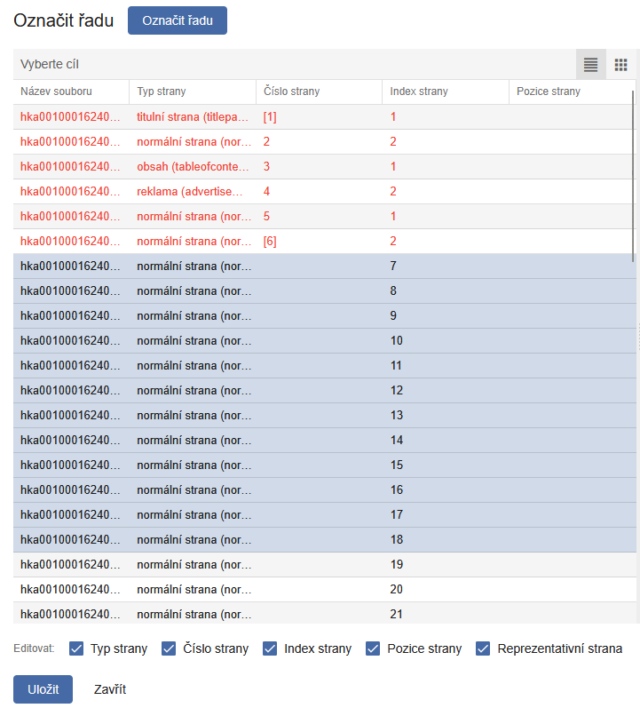
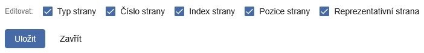
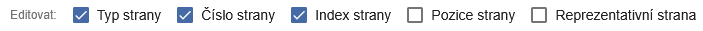
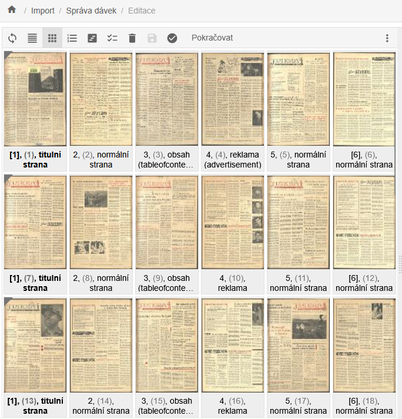

# Popis obrazových dat - Funkce označit řadu

Funkci **Označit řadu** využijete zejména v případech, kdy zpracováváte dokumenty se stejnou strukturou - například noviny nebo časopisy se stejným počtem stran a opakujícími se typy stran. 

Funkce vám umožní vytvořit si šablonu, kterou následně aplikujete na vybranou řadu skenů, aniž byste museli informace ke každé straně zadávat ručně.

## Vytvoření šablony

1.  Skeny označte běžným způsobem.

2.  Vytvořte šablonu na první části dokumentu - pro příklad ukázky
    označeno takto:

    - **\[1\]** - titulní strana (nečíslovaná, v hranatých závorkách),

    - **3** - obsah,

    - **4** - reklama,

    - **\[6\]** - poslední strana (opět nečíslovaná, proto v hranatých
      závorkách).

Ukázka rozložení s **Náhledy**:

{.bordered}

Rozložení obrazovek s využitím **Tabulky**:

{.bordered}

## Výběr řady

1.  Klikněte na první sken a pomocí klávesy **Shift** označte poslední
    sken v řadě.
    Alternativně můžete s podrženou klávesou **Ctrl** označit skeny
    jednotlivě.

2.  Po označení požadované řady klikněte na funkci **Označit řadu**
    (nachází se mezi tlačítky *Reindexovat* a *Vybrat všechny objekty*).

{.bordered}

Po aktivaci funkce **Označit řadu** se zobrazí nové okno. V levé části
jsou zobrazeny všechny naimportované skeny, vpravo pak jejich náhledy.
Červeně zvýrazněné skeny představují vytvořenou šablonu.

{.bordered}

Vyberte skeny, na které chcete šablonu aplikovat (např. strany 7-18).

{.bordered}

Kopírovat můžete Typ strany, Číslo strany, Index strany, Pozice strany a
typ Reprezentativní strana. Ve výchozím nastavení jsou všechny možnosti
zaškrtnuté:

{.bordered}

Pokud si nepřejete některý údaj kopírovat, jednoduše ho odškrtněte.
Například v ukázce níže nebude přenesena Pozice strany ani
Reprezentativní strana:

{.bordered}

Po přenesení údajů z vybrané šablony (\[1\]-\[6\]) se nové skeny
automaticky popíší podle zvolených parametrů. Ukázka výsledného
rozložení:

{.bordered}

!!! warning "Upozornění" 
    Pokud jste nepřenášeli Index strany, je nutné řadu dodatečně **zreindexovat**.

!!! tip "Tip"
    Doporučujeme také provést **validaci skenů** - tím zjistíte případné chyby nebo nesrovnalosti.

Následně můžete skeny přesunovat ke správnému číslu
nebo ročníku - viz [Úprava (editace) dokumentu](./periodika.md#uprava-editace-dokumentu).
