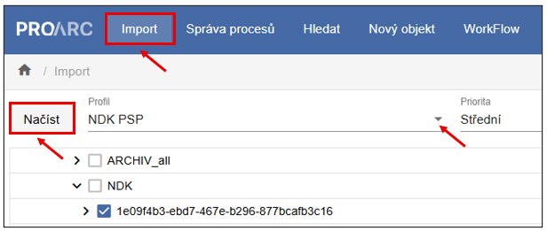
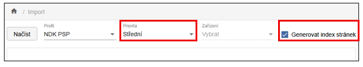
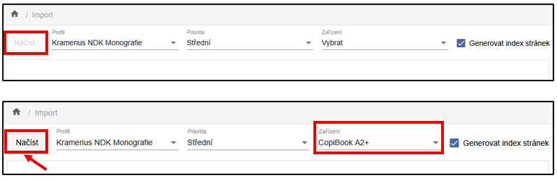
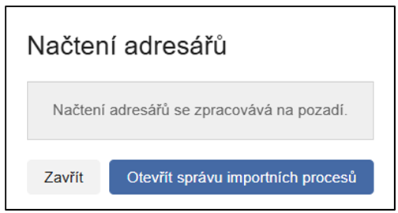
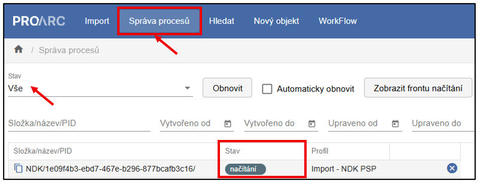
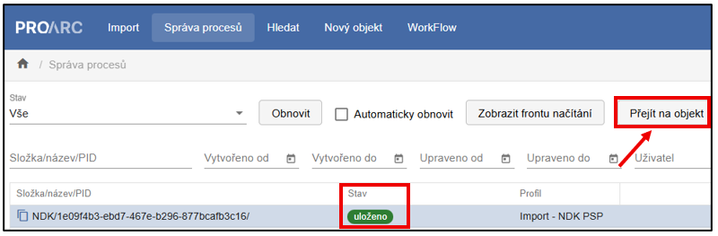

# Reimporty do ProArcu

ProArc umožňuje import již digitalizovaných a dříve zpracovaných
dokumentů.

Reimport balíčků je možný ze záložky **Import** a lze ji využít zejména
pro:

- dodatečné opravy chyb u dokumentů, které byly archivovány a následně z ProArcu odstraněny,

- doplnění nebo vylepšení OCR a ALTO,

- přesun objektů mezi instancemi ProArcu (např. při předávání digitalizovaných dokumentů mezi knihovnami v rámci replikace).

K dispozici je několik způsobů importu digitalizovaných dokumentů. Níže
jsou popsány tři nejběžnější:

- **Import archivního balíčku**  
    Pokud máte k dispozici archivní balíček dokumentu, jedná se o nejjednodušší a nejrychlejší způsob importu. Archivní balíček obsahuje všechny potřebné datastreamy a při importu jsou načteny v původní podobě.  
    Pro tento typ importu je určen importní profil `Archivace`.

- **Import NDK PSP balíčku**    
    NDK PSP balíček neobsahuje všechny datastreamy, obsahuje však data potřebná k jejich vygenerování během importu. Výsledkem je kompletní dokument, ze kterého lze následně vytvořit archivní balíček.  
    Pro tento typ importu je určen importní profil `NDK PSP`.

- **Import FOXML**  
    Pokud je k dispozici pouze FOXML formát digitalizovaného dokumentu (např. kopie exportovaná z digitální knihovny Kramerius), lze jej naimportovat do ProArcu, upravit a následně znovu exportovat pro Krameria.  

    FOXML však neobsahuje data, ze kterých by bylo možné vytvořit všechny datastreamy potřebné pro export NDK PSP nebo archivního balíčku. V tomto případě je tedy možné opět exportovat pouze FOXML.  
 
    Při importu FOXML je nutné zvolit importní profil podle typu dokumentu:

    - `Kramerius NDK Monografie`
    - `Kramerius NDK Periodikum`

----

## Import dokumentu do ProArcu na příkladu NDK PSP

1.  Umístěte NDK PSP balíček určený k importu do importní složky
    ProArcu.

2.  V horní navigační liště zvolte možnost **Import**.

3.  Z roletky vyberte importní profil `NDK PSP`. Tím se zpřístupní
    checkbox u připraveného balíčku.

4.  Označte balíček a stiskněte tlačítko **Načíst**.

5.  **Priorita** je ve výchozím stavu nastavena na **Střední**. Zvolíte-li vyšší prioritu, bude se dávka ve frontě zpracovávat dříve než ostatní. Jinak se zařadí na konec fronty.

6.  Funkce **Generovat index stránek** je ve výchozím stavu zapnutá.

!!! warning "Upozornění" 
    Import FOXML na rozdíl od ostatních typů importu vyžaduje zadání digitalizačního zařízení. Při výběru importního profilu je nutné zvolit **Zařízení** z příslušné roletky, jinak nelze import spustit.

    {width=600}

Systém následně informuje o tom, že průběh importu lze sledovat ve **Správě procesů**.

{width=300}

Ve Správě procesů je filtr pole **Stav** přednastaven na hodnotu `Načteno`. Pro sledování celého průběhu importu je vhodné změnit tuto hodnotu na `Vše`, aby bylo možné sledovat jednotlivé fáze procesu od Načítání přes Ukládání až po stav Uloženo.

Po úspěšném dokončení importu je možné dokument vyhledat v úložišti a dále s ním pracovat podle potřeby.

Alternativně lze ve Správě procesů uložený dokument označit. Pod lištou se zpřístupní tlačítko **Přejít na objekt**, jehož stisknutím se objekt otevře přímo v editaci.

Vlastníkem objektu se stává uživatel, který import spustil, a to bez ohledu na původního vlastníka dokumentu